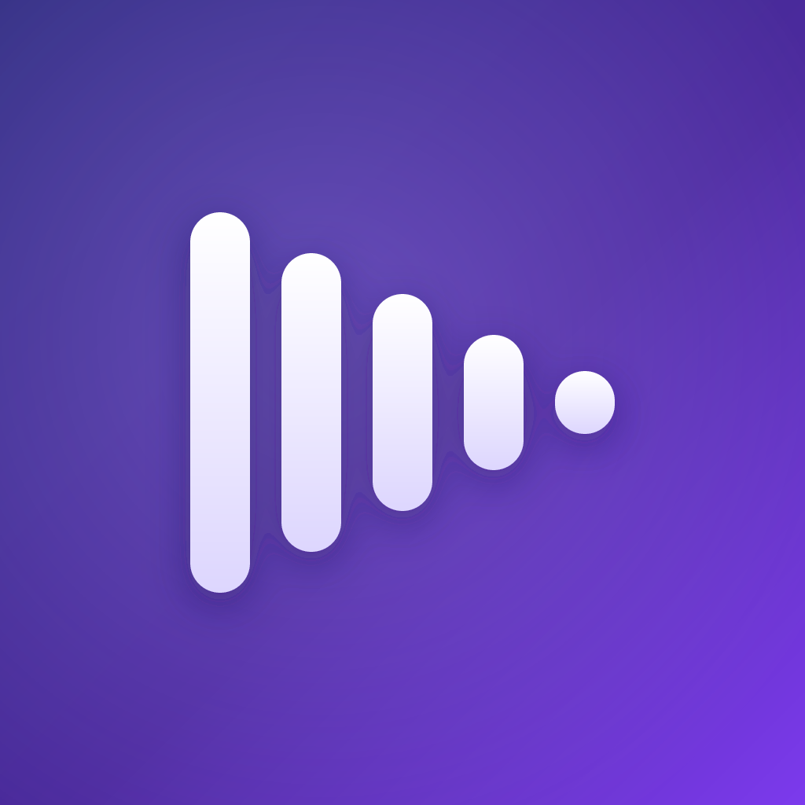
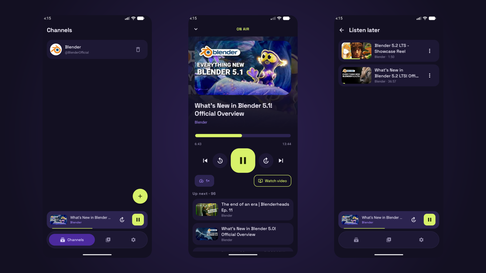
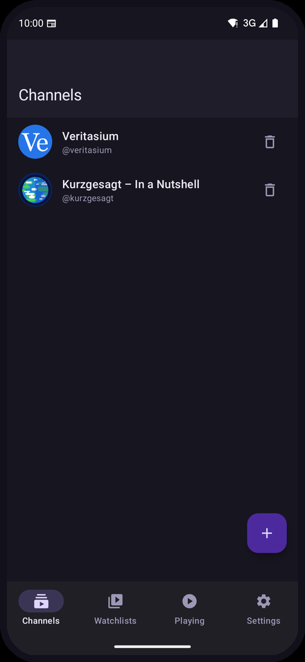
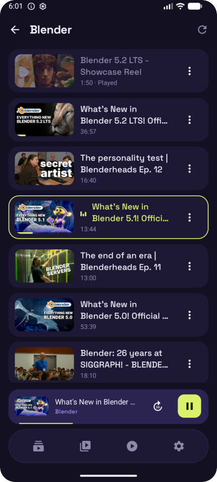
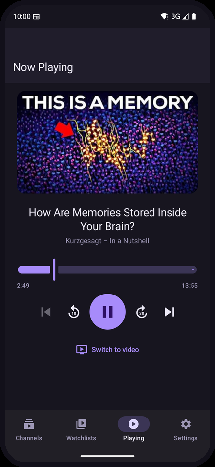
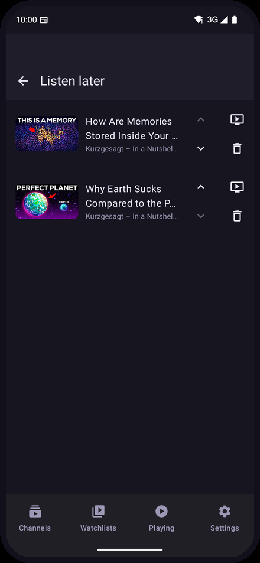
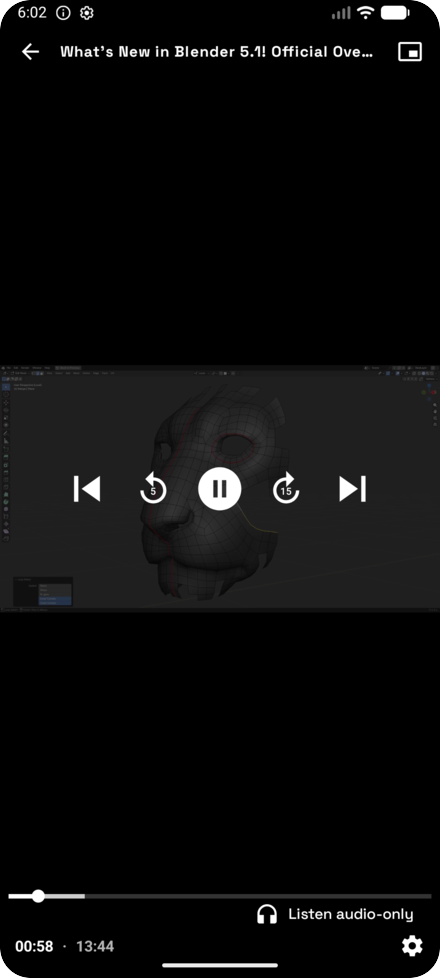
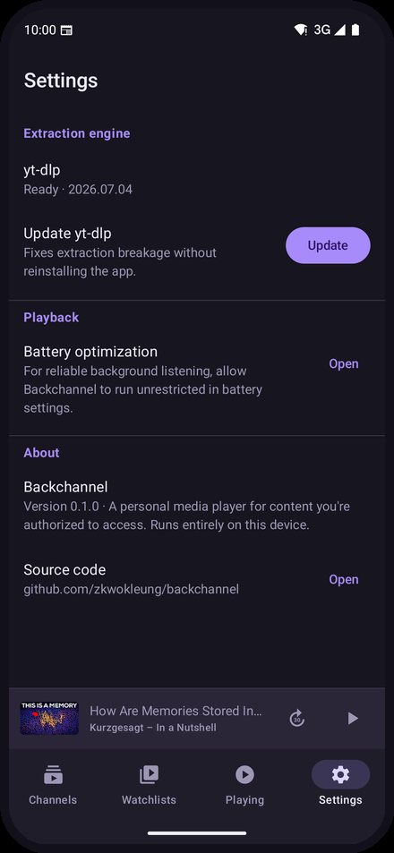
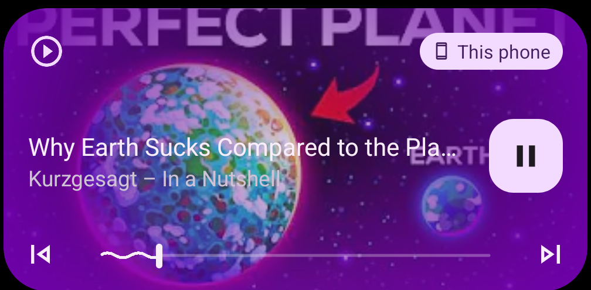
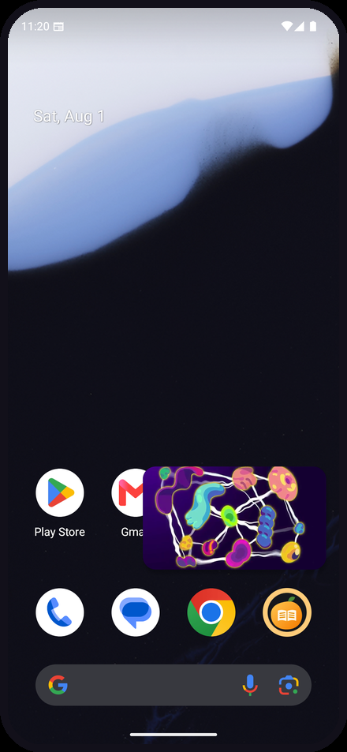

<div align="center">



# Backchannel

**Listen to YouTube channels like podcasts — on your phone, with no server behind it.**

[](#install)
[](android/)
[](android/)
[](#how-it-works)
[](LICENSE)



</div>

---

Backchannel saves the YouTube channels you follow and plays their uploads as **background audio** —
screen off, lock-screen controls, resuming exactly where you stopped. When you actually want to
watch something, the same item switches to video with picture-in-picture.

There is **no server, no account, and no cloud**. [yt-dlp](https://github.com/yt-dlp/yt-dlp) is
embedded in the app and runs on your phone; your subscriptions and history live in a local
database that never leaves the device.

## Features

|  |  |
|---|---|
| 🎧 **Listen, don't watch** | Audio-only playback that keeps going with the screen off, with lock-screen and notification controls |
| ⏯️ **Resume where you stopped** | Position is saved continuously — kill the app mid-episode and pick it up later |
| 📺 **Switch to video anytime** | The same item flips from audio to video, keeping its position, with picture-in-picture |
| 📋 **Watchlists** | Queue videos across channels, reorder them, play the list end to end |
| 🔄 **Self-healing extraction** | yt-dlp updates itself inside the app, so YouTube-side breakage is fixed without a new release |
| 🔌 **Nothing phones home** | No backend, no account, no analytics. Cached lists stay browsable offline |
| 💾 **Save for offline** | Keep the audio (or video) of an item on the device and listen with no connection — on a flight, or to spare mobile data |

## Screens

<table>
  <tr>
    <td width="33%" align="center"><br><b>Channels</b><br><sub>Add by @handle or URL</sub></td>
    <td width="33%" align="center"><br><b>Uploads</b><br><sub>Cached locally, pull to refresh</sub></td>
    <td width="33%" align="center"><br><b>Now Playing</b><br><sub>Scrub, skip, ±30s</sub></td>
  </tr>
  <tr>
    <td align="center"><br><b>Watchlists</b><br><sub>Your own queues</sub></td>
    <td align="center"><br><b>Video</b><br><sub>Same item, full screen</sub></td>
    <td align="center"><br><b>Settings</b><br><sub>Update the engine in-app</sub></td>
  </tr>
</table>

**Keeps playing everywhere.** Lock-screen and notification controls come from a real media
session, and video shrinks into a floating window when you leave the app.

<table>
  <tr>
    <td width="58%" valign="top"></td>
    <td width="42%" valign="top"></td>
  </tr>
</table>

## How it works

Most YouTube clients need a server: extraction is too heavy for a phone, and stream URLs are
IP-locked to whoever resolves them. Backchannel sidesteps both by doing the extraction **on the
device that plays the audio** — so the URL is valid, and there is nothing to host.

```
┌─ Your phone ─────────────────────────────────────────────────────┐
│                                                                  │
│  Compose UI ──► Room (channels · watchlists · playback state)    │
│       │                                                          │
│       └──────► YtdlpEngine ──► yt-dlp on an embedded Python      │
│                     │           (youtubedl-android)              │
│                     ▼                                            │
│              direct stream URL                                   │
│                     │                                            │
│                     ▼                                            │
│         Media3 ExoPlayer + MediaSessionService                   │
│         background audio · lock screen · PiP                     │
└──────────────────────────────────────────────────────────────────┘
                              │
                              ▼   only outbound traffic
                          YouTube
```

| Concern | Choice |
|---|---|
| UI | Jetpack Compose · Material 3 · Navigation Compose |
| Extraction | [youtubedl-android](https://github.com/yausername/youtubedl-android) — embedded yt-dlp, updatable at runtime |
| Playback | Media3 ExoPlayer behind a `MediaSessionService` |
| Storage | Room (SQLite), on-device only |
| Project | `android/` — single-module Gradle build, ~3.4k lines of Kotlin |

## Install

Grab an APK from [Releases](../../releases) — **arm64-v8a** suits essentially every modern phone;
`universal` works anywhere but is roughly 3× larger. Verify it against `SHA256SUMS.txt`, then open
it and allow installation when Android prompts.

Or build it yourself (JDK 17 + Android SDK, nothing else):

```bash
git clone https://github.com/zkwokleung/backchannel
cd backchannel/android
./gradlew assembleDebug
adb install app/build/outputs/apk/debug/app-arm64-v8a-debug.apk
```

> **First launch** updates the embedded yt-dlp before the first extraction — a few seconds. The
> copy shipped inside the library is months old and would silently return nothing.

📖 **[Usage guide](docs/USAGE.md)** — adding channels, background playback, troubleshooting
🔧 **[Developer guide](docs/DEVELOPING.md)** — architecture, the non-obvious constraints, releases

## Platform support

**Android 8.0+ only.** The embedded-Python approach that removes the server has no iOS
equivalent, and Apple's App Store rejects yt-dlp-backed apps — so iOS is not on the roadmap.

## Legal & scope

Backchannel is a **personal media client for content you are authorized to access**. It bundles no
video, hosts nothing, and fetches only what its operator asks for — the same posture as the yt-dlp
tool it builds on.

- ✅ Personal, on-device use — saved copies live in the app's private storage and go with it on uninstall
- ❌ Not for re-hosting, re-distributing, or serving content to other people
- ❌ Not for circumventing DRM or accessing paid or age-gated content

You are responsible for complying with the terms of any service you use it with. This is not legal
advice.

## License

[MIT](LICENSE)
